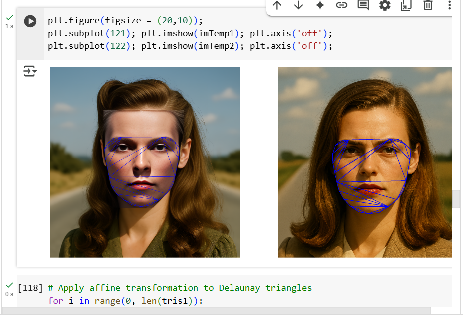
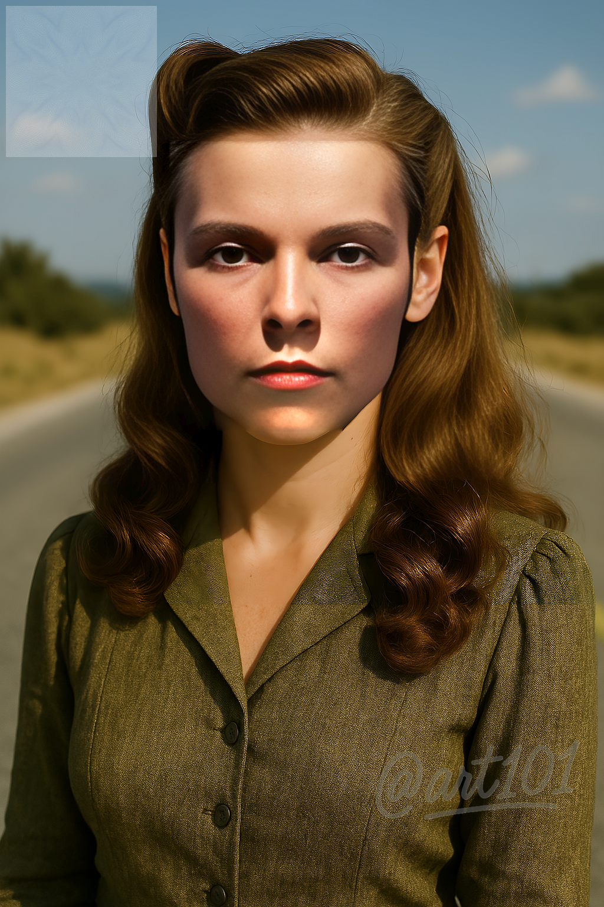

# German Lost Lady (GLL) WWII

## Overview
This project embarks on a profound reconstruction journey—an attempt to piece together the face of a woman lost in the chaos of World War II. Through meticulous digital restoration and deep learning techniques, we strive to unveil what is believed to be an accurate reconstruction, derived from the unscathed portion of her face.

The tragedy of violence and war manifests in countless ways, and while Picasso’s *Guernica* has become an emblem of war horrors, GLL should stand as a solemn testament to the fight against violence inflicted upon women DAILY. The wounds she bore—likely the remnants of unspeakable brutality—mirror the silent agony endured by countless women throughout history, their suffering often overlooked in our society.

## Reconstruction Process
The restoration of GLL’s face involved several advanced image reconstruction techniques, including:

- **CV2 Library:** Used for facial replacement following hull convex calculations.
- **Colorization Models:** Implemented *ECCV16* and *SIGGRAPH17* to restore realistic tones.
- **NVIDIA StyleGAN2:** Though explored, results were not as satisfactory.
- **GIMP & CV2 Manipulation:** Enabled manual refinements and precision adjustments.
- **GFPGAN Algorithm:** Applied for enhanced facial restoration and detail refinement.
- **Generative image creators:** were used for the full body images, inspired in 1945 when the event took place.
- **Google colab:** Python was used to manipulate the images and do the face replacement.
- **AI code helpers:** Were used to code, it too, via prompting.

Each step was executed with a commitment to authenticity, ensuring that the reconstructed image is as close as possible to its historical truth.

For more information on the topic of GLL you can search it in youtube.

## A Reflection on War & Violence
Beyond mere reconstruction, this project stands as a stark reminder that the scars of war extend far beyond the battlefield. They infiltrate homes, communities, and histories—especially for those who suffered not as combatants but as victims of cruelty. If *Guernica* symbolizes war itself, GLL should serve as the face of resilience against gender-based violence.

This repository preserves not only an image but a narrative—one that must not be forgotten.

Observation: The prominence of her brow and cheekbones could indeed suggest malnutrition during the filan stages of WWII. In image hiru.png(three) she is not malnutritioned and it is included for contrasting purposes.
---

## Sample Results
Here is a sample of two reconstructed images obtained during the process:

These images serve as a testament to the technological and artistic efforts that have gone into reimagining history.

Note: the discrepancy of the eyes and some face features are left intentionally, I did not intend to do a realistic photographic reconstructions but I wanted to some of the AI tools available to bring her face to the light. 
---

## Videos

Some videos can be found in the videos folder.

## Contact
For inquiries, discussions, or further exploration of this project, feel free to reach out via Instagram:

- [@artgen101](https://www.instagram.com/artgen101)

---
## Credit
Please credit should you be using these images. 

